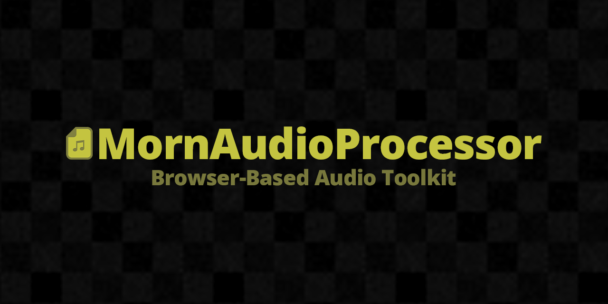

  

  
  

## 概要

MornAudioProcessor は、MP3・WAV・OGG・FLAC ファイルをブラウザ上で一括加工できる Web アプリケーションです。
ffmpeg.wasm を利用してクライアントサイドで処理を行うため、ファイルがサーバーにアップロードされることはありません。

**https://tsukumistudio.github.io/MornAudioProcessor/**

## 基本機能

- **フォーマット変換** — MP3 / WAV / OGG / FLAC 間の相互変換
- **音量調整** — Peak / RMS / LUFS 正規化、または dB 単位の増減
- **ビットレート変更** — 64k 〜 320k から選択（mp3 / ogg）
- **ビット解像度変更** — 16 / 24 / 32-bit（wav / flac）
- **サンプルレート変更** — 44.1 kHz / 48 kHz
- **無音削除** — 先頭・末尾の無音を自動検出して除去（閾値調整可能）
- **ノイズ除去** — FFT (afftdn) / NLM (anlmdn)

## 高度な機能

「高度な機能」を有効にすると、ffmpeg のフィルタをタブごとに直接設定できます。

- **周波数系** — イコライザー、ハイパス、ローパス、バンドパス、低音/高音、ダイナミック EQ など
- **ダイナミクス系** — コンプレッサー、リミッター、ゲート、ダイナミックノーマライザー、ソフトクリップなど
- **エフェクト系** — エコー、コーラス、フランジャー、フェイザー、トレモロ、ビブラート、テンポ、ピッチ、ビットクラッシャー、リバース、フェードなど
- **チャンネル系** — モノラル / ステレオ変換、左右バランス
- **修復系** — クリックノイズ除去、クリッピング修復、ウェーブレットノイズ除去、ディエッサー
- **ステレオ系** — ステレオツール、ステレオ幅、クロスフィード、Haas、セリフ強調
- **メタ編集** — タグとアルバムアートの編集（全ファイル一括 / ファイルごとの個別指定）

## その他

- **自動解析** — 投入したファイルの長さ・ビットレート・サンプルレート・Peak / RMS / LUFS を表示
- **波形比較** — 任意の 2 ファイルを A / B に指定して波形を並べて確認
- **プレビュー再生** — 変換前・変換後の音声をその場で試聴
- **ドラッグ&ドロップ** — ファイルをウィンドウにドロップして追加
- **一括処理** — 複数ファイルを最大 4 並列で処理、進捗をリアルタイム表示
- **ZIP ダウンロード** — 変換結果をまとめて取得

## ライセンス

[The Unlicense](LICENSE)
